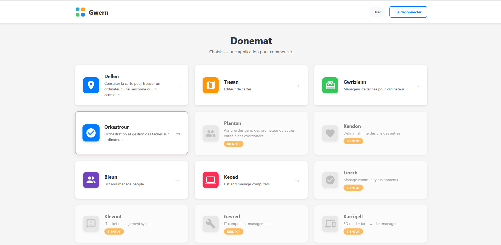
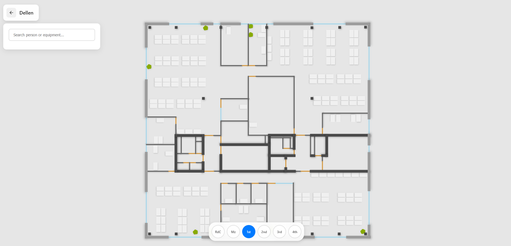
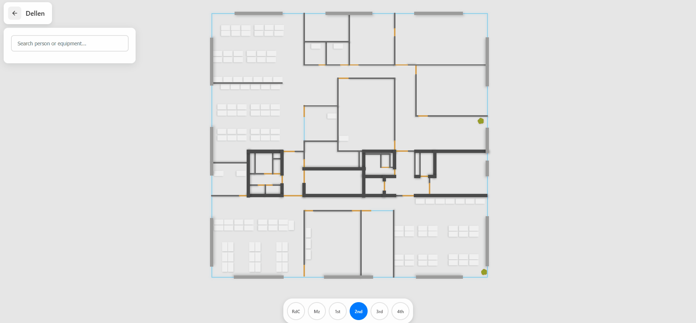
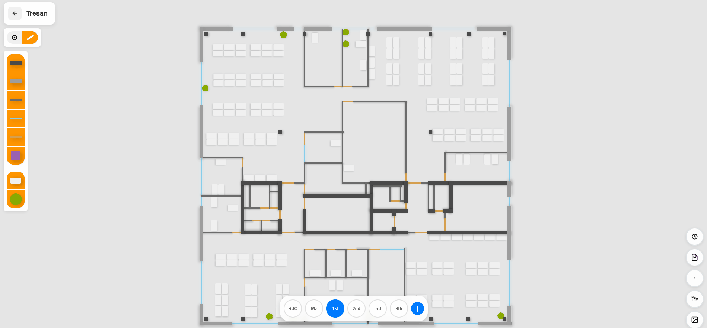
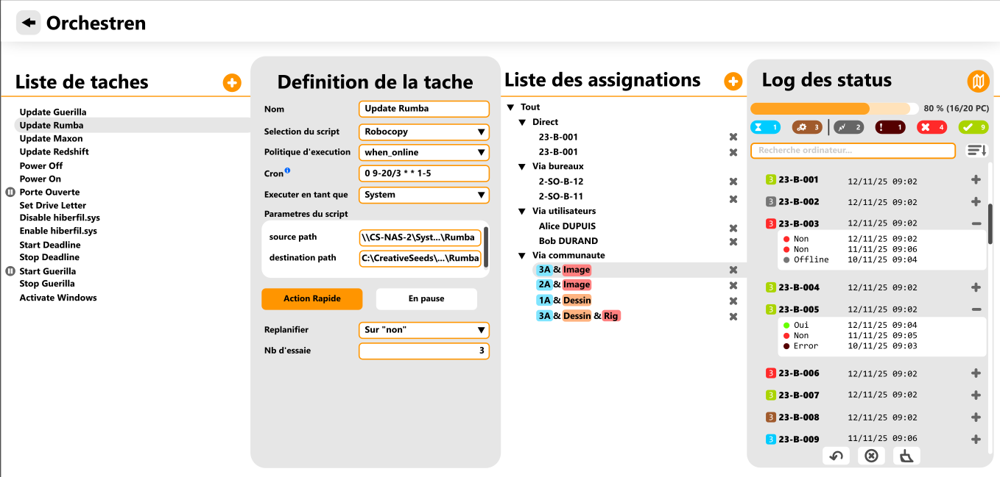
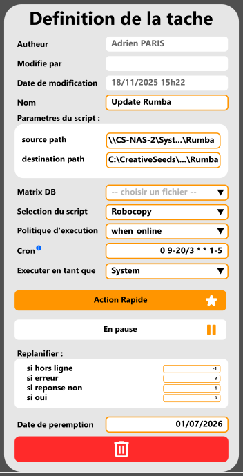
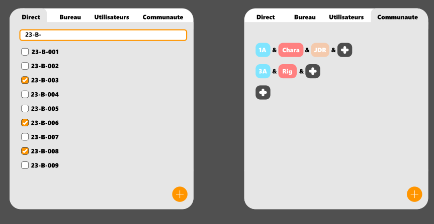
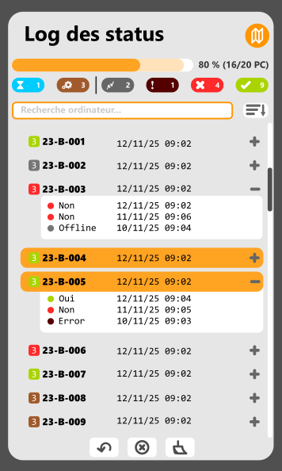
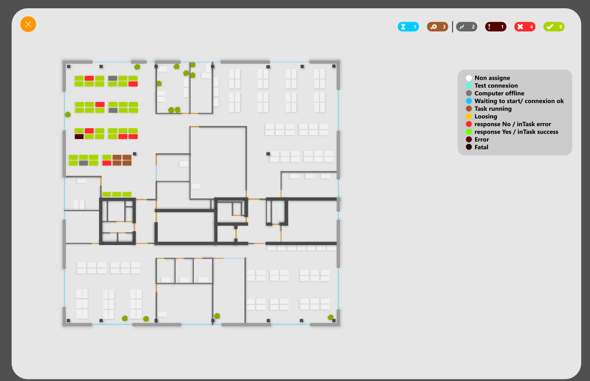

L'idée est de repartir sur des bases propre.

Une bonne partie de ce que j'avais écris quand j'était en poste, à été généré par IA, parce que deadline, parce qu'on  avait besoin d'un outil qui fonctionne maintenant, peut importe la qualité, peut importe la sécurité, peut importe la pérénité. "On remmettra au propre plus tard"

Et bien aujourd'hui est plus tard!

Donc on recommence tout, oui mais on a des bases !

# Présentation
Je vais déjà commencer par vous montrer ce qui existait déjà.

On avait un dashboard,

Où chaque application avait un but simple et précis.
- Dellen, permettait d'afficher la carte
- Tresan, de l'editer
- Gwrizienn (qui voulais dire racine en bbreton, oui, faut trouver un autre nom) sevait à définire des sortes de variables d'environnements, telles que des chemins de dossiers/fichiers
- Orkestrour/orchestren, était une des pièce maitresse, qui permettait de planifier des tâches sur des PCs
- Bleun, qui permettait de gérer la listes des gens
- et Keoad qui permettait de gérer la listes des ordinateurs
Et plein d'autre applications qui permettait de jouer avec la base de données

Vous remarquerez le mot Gwern, qui était le premier nom d'Endro

# La carte
Voici une illustration du plan telle qu'il existait dans l'ancienne version.

De là, il était possible de chercher une ressource

Et sur tresan, on pouvait dessiner notre plan.

Un clic droit permettait de créer des éléments

il y avait des tools d'alignement et d'identification de bureau

# Orchestrateur
Le nerd de la guerre.
Cette outil avait pour but de lancer des script custom sur les PCs selectionner.
Voici quelques mockups

De gauche à droite, quatre colonnes:
- la liste des taches
- La definition de la tache selectionnée
- l'assignation aux différents ordinateurs
- l'état de l'execution des scripts

Dans cette onglet, on choisissait le nom, le script, et les arguments à passer au script.

Il y avait quelques conditions d'executions, puis la possibilité d'en faire une action rapide pour l'invoquer depuis d'autres applications.

Pour choisir quel ordinateur allait executer la tâche, on pouvait soit choisir :
- le nom de l'ordinateur
- le bureau, sur lequels était assigné l'ordinateur
- La personne, qui était assigné au même bureau que celui de l'ordinateur
- Le ou les groupes de gens, desquels étaient assigné au même bureau que l'ordinateur.

On avait ensuite la liste de tout les ordinateurs qui nous affichait l'avancement de l'execution de la tâche.

Et en prime une petite carte sur laquelle était indiqué l'état de chaque tour.

# Le backend

ça va être une des plus grande reprise à zéro.
Là où avant on avait un backend en python, le choix à été prix de basculer en C#
C'est tout le backend qui est à reconstruire.