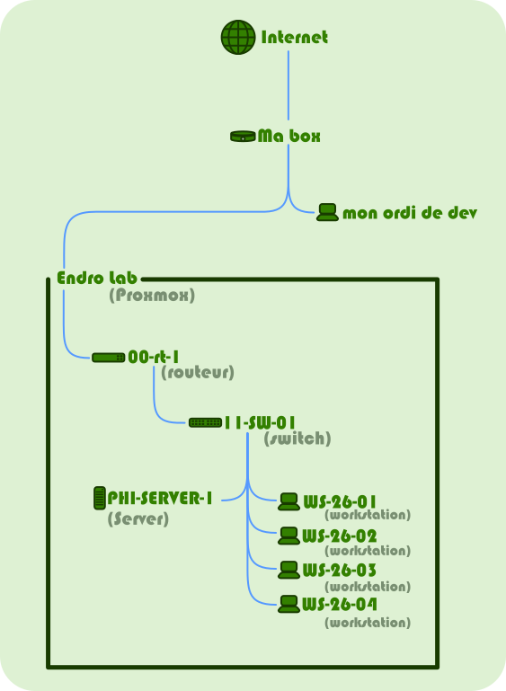

Ok! j'ai du acheter quelques bricoles avant de commencer, comme un cables minidisplay port et une clef usb, car j'était en rad. Mais nous voilà parti!

A l'aide de rufus, on grave proxmox sur la clef usb, on lance l'installation, et une fois celle ci faite, on peut se connecter enfin sur l'interface web.

## Le serveur

J'y créer ma première VM, qui sera un sereur __TrueNAS__ sur lequels je ferais tourner quelques services ainsi que l'image docker de Endro.

Nous l'appelerons __LAB-SERVER-1__

on va devoir créer un réseau aussi.

## Le réseau

Pour ça, on va créer deux nouvelle VM, une pour émuler un routeur et une autre pour le switch.

Et oui, je ne vais pas me servir du sytème de réseau de proxmox.

Je dois créer ces deux VMs, car le but sera de faire en sorte qu'Endro puisse intéragire avec.

Donc le routeur sera sous __opensens__ et le switch sous __VyOS__

Bon, par contre pour connecter le tout pour faire comme si on était vraiment dans un parc, ça va être un sacré bazard.

J'ai créer 2 réseau dans proxmox, un lab_inter, et un lab_local. tout deux sont des _linux bridge_

Le __lab_inter__, le plus simple, ne connectera juste que le routeur au reste du monde.

Le __lab_local__, lui, va se comporter comme un switch classic. Donc toutes les machines connecté dessus sont déjà relié les unes aux autres. Mon switch virtuel n'a donc aucune raison d'être.

Cependant, on a rendu ce réseau _vlan aware_. Ce qui signifie que l'on va pouvoir créer des tags sur chaques machines et sur chaque port du switch virtuel.

Ainsi, on va pouvoir avoir des tuyaux bien séparé comme si c'était un câble simple.

Rien de particulier, vous me direz, c'est le principe d'un vlan, seulement, ça reste toujours pertubant quand on a deux couches d'abstractions:

Les vlan du proxmox, et ceux que le parc aura, ceux qui seront modifié par Endro

Sur __VyOS__, il faut aussi émuler la puce qui relie tout les ports entre eux.
Car, on peut créer autant de carte réseau que l'on veut, mais il faut que l'on créer un bridge virtuel entre toutes les cartes, car ce n'est pas un switch sortit de la boite.

## Les postes de travail

Pour les workstation, pour l'instant, on va leurs installer des __almalinux__